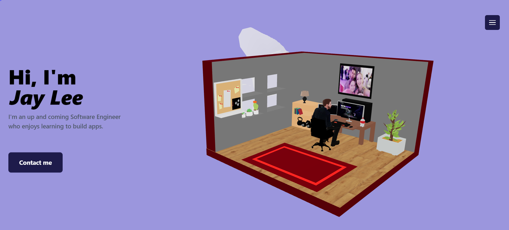

# Animated Portfolio

## Introduction
This is a readme file for an animated portfolio project. The animated portfolio is a dynamic and visually appealing way to showcase your work, skills, and achievements. By incorporating animations, transitions, and interactive elements, it adds an extra level of engagement and interactivity for viewers.

## Features
Animations: The portfolio is designed with animations to bring life and visual interest to the content. Animations can be used to highlight important elements, provide smooth transitions between sections, and create an engaging user experience.

Interactive Elements: The portfolio includes interactive elements such as buttons, hover effects, and scroll-triggered animations. These elements encourage user interaction and make the portfolio more engaging and memorable.

Responsive Design: The portfolio is built with a responsive design approach, ensuring that it looks and functions well across different devices and screen sizes. It adapts to mobile, tablet, and desktop screens, providing a consistent experience for users.

Easy Customization: The portfolio is designed to be easily customizable to fit your personal brand and style. You can easily change colors, fonts, layout, and add your own content to make it unique and reflective of your work.

Optimized Performance: The portfolio is optimized for performance to ensure fast loading times and smooth animations. By minimizing file sizes, optimizing code, and utilizing performance best practices, the portfolio provides a seamless browsing experience.

## Getting Started
To get started with the animated portfolio, follow these steps:

1.Clone the repository or download the project files to your local machine.
2.Open the project folder in your preferred code editor.
3.Customise the portfolio by modifying the files. You can add your own content, update the styling, and adjust animations according to your preferences.
4.Test the portfolio locally by opening the file in a web browser. Make sure all the animations, transitions, and interactive elements are working as expected.
5.Deploy the portfolio to a web server or hosting platform of your choice. This will make it accessible to others on the internet.

